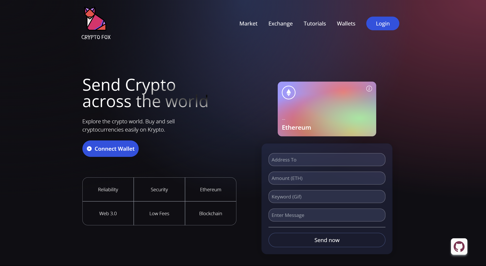

# Web3 Crypto Exchange dApp with Solidity and React Vite





### Welcome to our Web3 Crypto exchange decentralized application (dApp) built using Solidity and React Vite

## Features:
- **Decentralized Crypto Exchange:** Utilizes blockchain technology to enable transparent and decentralized fundraising campaigns.
- **Smart Contracts:** Implemented using Solidity and hardhat, ensuring secure and autonomous execution of Crypto Exchange campaigns.
- **[Hardhat](https://hardhat.org/) Ethereum development:** Easily deploy your contracts, run tests and debug Solidity code without dealing with live environments.
- **[Vite](https://vitejs.dev/) React Interface:** User-friendly interface built on React for seamless interaction with the dApp.

## Getting Started

To set up and run this dApp locally, follow these steps:

### Prerequisites

- Node.js installed on your machine (required)
- Metamask extension (required)
- Git (optional)

### Installation

1. Clone the repository to your local machine:

   ```bash
   git clone https://github.com/minhajhameed/web3-crypto-exchange.git
   ```
   Or download and extract the repository zip file.

1. Navigate to the project directory:

   ```bash
   cd web3-crypto-exchange
   cd /client
   ```
2. install dependencies using npm or yarn:

   ```bash
   npm install
   # or
   yarn install
   ```
3. Start the dApp:

   ```bash
    npm run dev
    # or
    yarn start
   ```
   
## License:
This project is licensed under the [GPL-3.0 License](LICENSE).

## Contact:
For any questions or feedback, feel free to reach out to us at [minhajham@yahoo.com](mailto:minhajham@yahoo.com).

